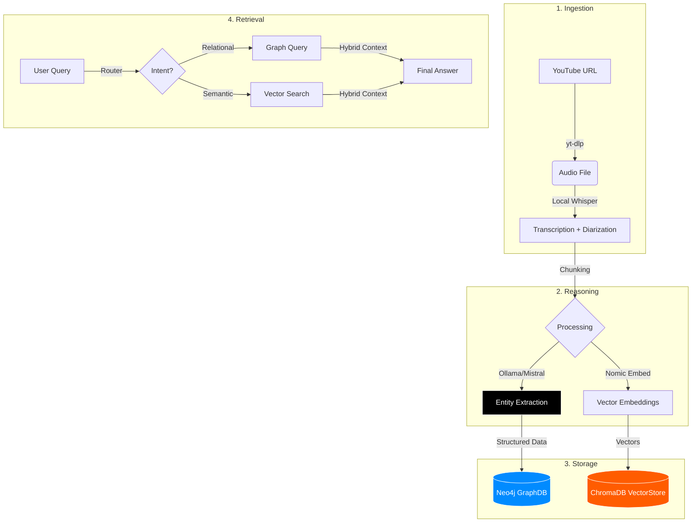

# 🎙️ Podcast Knowledge Graph (GraphRAG System)


A local-first **Graph Retrieval-Augmented Generation (GraphRAG)** system that transforms unstructured podcast audio into a structured, queryable Knowledge Graph.

> **Design Philosophy:** Privacy-First, Zero-Cost Operation, Hybrid Search Optimization.

## 🌟 Key Features

*   **🔒 Local-First Processing:** Runs entirely offline using **Ollama (Mistral)** for reasoning and **Whisper** for transcription. No data leaves your machine.
*   **🕸️ Knowledge Graph Construction:** Automatically extracts and links entities (`Person`, `Book`, `Company`, `Topic`) with semantic relationships (`RECOMMENDED_BY`, `MENTIONED_IN`).
*   **🧠 Hybrid Search:** Combines **Graph Traversal** (Cypher) for precision with **Vector Search** (ChromaDB) for semantic nuance.
*   **🗣️ Speaker Diarization:** Identifies Hosts vs. Guests using acoustic segmentation and semantic heuristics.
*   **⚡ Cost-Optimized:** Implements L1/L2 Caching and Local LLMs to eliminate API costs ($0 OpEx).

---

## 🏗️ Architecture

System pipeline using **Local-First GraphRAG**:



### Data Science Decisions
*   **Chunking:** Context-Aware Overlapping Windows (2000 tokens + 10% overlap).
*   **Graph Schema:** Property-rich edges (e.g., `RECOMMENDED_BY` has `sentiment`, `timestamp`).
*   **Diarization:** Hybrid approach using Whisper segments + Semantic Role Labeling.

---

## 🚀 Quick Start

### Prerequisites
*   Python 3.10+
*   **FFmpeg** (for audio processing): `brew install ffmpeg`
*   **Ollama** (for Local LLM): [Download Ollama](https://ollama.ai/)
    *   Pull the model: `ollama pull mistral`
    *   Start server: `ollama serve`

### Installation

1.  **Clone the repository**
    ```bash
    git clone https://github.com/omerfarukballi/Case-LLM.git
    cd podcast-kg
    ```

2.  **Install Dependencies**
    ```bash
    pip install -r requirements.txt
    ```

3.  **Configuration**
    Copy `.env.example` to `.env`:
    ```bash
    cp .env.example .env
    ```
    *Set `USE_LOCAL_LLM=True` in `.env` for offline mode.*

4.  **Run the UI**
    ```bash
    streamlit run ui/app.py
    ```

---

## 🛠️ Technology Stack

| Component | Technology | Role |
| :--- | :--- | :--- |
| **LLM** | Ollama (Mistral) / GPT-4 | Entity Extraction & Reasoning |
| **STT** | OpenAI Whisper (Local) | Speech-to-Text Transcription |
| **Graph DB** | Neo4j | Storing structured relationships |
| **Vector DB** | ChromaDB | Semantic search & Context retrieval |
| **Framework** | LangChain / Pydantic | Orchestration & Data Validation |
| **UI** | Streamlit | Interactive Dashboard |

## 🧪 UAT Scenario Verification

This architecture was specifically built to pass complex User Acceptance Tests:

| Challenge Category | UAT Scenario Example | Our Architectural Solution |
| :--- | :--- | :--- |
| **1. Complex Logic** | *"Books recommended by David Senra excluding Steve Jobs bios?"* | **Graph Schema:** `(Person)-[:RECOMMENDED]->(Book)` with Cypher filtering. |
| **2. Hallucinations** | *"Did Lex Fridman interview Satoshi?"* | **Graph Validation:** Verifies path existence `(Lex)-[:APPEARED_ON]-(Satoshi)` before answering. |
| **3. Temporal Logic** | *"What was said about 'Olympics' in 2024?"* | **Metadata Filtering:** Enforces `year: 2024` filter in Vector Search. |
| **4. Synthesis** | *"Common guests between All-In and JRE?"* | **Graph Intersection:** O(1) complexity query for node intersection. |
| **5. Implicit Meaning** | *"Who criticized PE implicitly?"* | **Semantic Search:** Embeddings capture concepts ("misaligned incentives") without keywords. |

## 📄 Documentation

*   [🇹🇷 Teknik Dökümantasyon (Turkish)](docs/TEKNIK_DOKUMANTASYON_TR.html) - Detailed Interview Guide
*   [🇺🇸 Technical Documentation (English)](docs/TECHNICAL_DOCUMENTATION.html) - Architecture & QA
