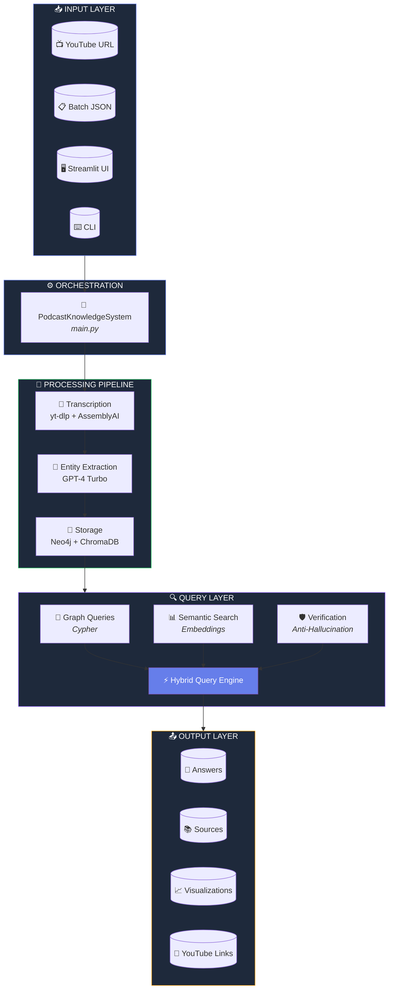

<div align="center">

# 🎙️ Podcast Knowledge Graph System

### AI-Powered Podcast Analysis with Knowledge Graph & Semantic Search

[](https://python.org)
[](https://openai.com)
[](https://neo4j.com)
[](https://streamlit.io)

---

**Transform YouTube podcasts into queryable knowledge graphs with AI-powered entity extraction, semantic search, and hallucination-resistant answers.**

[Features](#-features) • [Architecture](#-system-architecture) • [Quick Start](#-quick-start) • [Documentation](#-documentation)

</div>

---

## 📊 Key Metrics

<div align="center">

| Entity Precision | Query Latency | Entity Types | UAT Scenarios |
|:----------------:|:-------------:|:------------:|:-------------:|
| **>95%** | **<2s** | **10+** | **30** |

</div>

---

## ✨ Features

<table>
<tr>
<td width="50%">

### 🎵 YouTube Integration
Download and process any YouTube podcast with **yt-dlp** audio extraction and automatic metadata fetching.

### 🗣️ Speaker Diarization
Identify **who said what** using AssemblyAI's advanced speaker labeling technology.

### 🧠 Entity Extraction
Extract **People, Books, Movies, Companies, Topics** using GPT-4 structured outputs with >95% precision.

</td>
<td width="50%">

### 🔗 Knowledge Graph
Build rich relationships in **Neo4j** with 10+ node types and 8+ relationship types.

### 🔍 Semantic Search
Vector similarity search using **OpenAI embeddings** and ChromaDB for content discovery.

### 🛡️ Hallucination Prevention
Multi-layer verification system ensures **accurate, evidence-based answers** with source citations.

</td>
</tr>
</table>

---

## 🏗️ System Architecture



---

## 🛠️ Technology Stack

<div align="center">

| Layer | Technology | Purpose |
|:-----:|:----------:|:-------:|
| **Language** |  | Core development |
| **LLM** |  | Entity extraction & synthesis |
| **Embeddings** |  | Semantic vectors |
| **Transcription** |  | Speech-to-text + diarization |
| **Graph DB** |  | Knowledge graph |
| **Vector DB** |  | Embedding storage |
| **UI** |  | Web interface |
| **Video** |  | Audio extraction |

</div>

---

## 🚀 Quick Start

### Prerequisites

- Python 3.10+
- Docker (for Neo4j)
- API Keys: OpenAI, AssemblyAI

### Installation

```bash
# Clone repository
git clone https://github.com/yourusername/podcast-kg.git
cd podcast-kg

# Create virtual environment
python -m venv venv
source venv/bin/activate  # Windows: venv\Scripts\activate

# Install dependencies
pip install -r requirements.txt

# Configure environment
cp .env.example .env
# Edit .env with your API keys
```

### Start Neo4j

```bash
docker run -d --name neo4j \
  -p 7474:7474 -p 7687:7687 \
  -e NEO4J_AUTH=neo4j/yourpassword \
  neo4j:latest
```

### Process Your First Video

```bash
# Process a YouTube video
python main.py --url "https://youtube.com/watch?v=VIDEO_ID" --podcast "Podcast Name"

# Query the knowledge graph
python main.py --query "List all books recommended in podcasts"

# Launch Streamlit UI
streamlit run ui/app.py
```

---

## 📁 Project Structure

```
podcast-kg/
├── 📄 main.py                    # Main orchestrator & CLI
├── ⚙️ config.py                   # Configuration settings
├── 📦 models/
│   ├── entities.py               # Pydantic data models
│   └── graph_schema.py           # Neo4j schema definitions
├── 🔧 services/
│   ├── transcription.py          # YouTube download & transcription
│   ├── entity_extraction.py      # GPT-4 entity extraction
│   ├── graph_builder.py          # Neo4j operations
│   ├── vector_store.py           # ChromaDB semantic search
│   └── query_engine.py           # Hybrid query engine
├── 🖥️ ui/
│   ├── app.py                    # Streamlit main app
│   └── components.py             # UI components
├── 🧪 tests/
│   ├── test_uat.py               # 30 UAT test scenarios
│   └── test_integration.py       # Integration tests
└── 📂 data/
    └── videos.json               # Video configurations
```

---

## 🔍 Query Types

<table>
<tr>
<td align="center" width="25%">
<h3>🔗 GRAPH</h3>
<p><i>Relationships & connections</i></p>
<code>"List all books recommended by David Senra"</code>
</td>
<td align="center" width="25%">
<h3>📊 SEMANTIC</h3>
<p><i>Content & quotes</i></p>
<code>"What did they say about AI safety?"</code>
</td>
<td align="center" width="25%">
<h3>⚡ HYBRID</h3>
<p><i>Graph + Semantic</i></p>
<code>"Trace AI concept across podcasts"</code>
</td>
<td align="center" width="25%">
<h3>🛡️ VERIFY</h3>
<p><i>Fact checking</i></p>
<code>"Did Lex Fridman interview X?"</code>
</td>
</tr>
</table>

---

## 🛡️ Hallucination Prevention

> ⚠️ **Critical Feature**: Multi-layer verification prevents AI hallucinations

| Layer | Check | Action |
|:-----:|:-----:|:------:|
| 1️⃣ **Entity Verification** | Does entity exist in graph? | Reject if not found |
| 2️⃣ **Relationship Check** | Does claimed relationship exist? | Verify before answering |
| 3️⃣ **Date Filtering** | Is content within date range? | Filter out-of-range |
| 4️⃣ **Speaker Validation** | Did speaker appear in episode? | Verify attribution |
| 5️⃣ **Evidence-Based** | Is answer based on data? | Never invent information |

---

## 🧪 UAT Test Scenarios

<details>
<summary><b>📚 Entity Extraction (UAT-01 to UAT-10)</b></summary>

- ✅ Book recommendations with filters
- ✅ Movie metaphor extraction
- ✅ Common guests between podcasts
- ✅ Company sentiment tracking
- ✅ Entity disambiguation (book vs movie)
- ✅ Implicit reference detection
- ✅ Fact checking
- ✅ Sponsor filtering
- ✅ Location extraction
- ✅ Music references

</details>

<details>
<summary><b>🛡️ Hallucination Resistance (UAT-11 to UAT-20)</b></summary>

- ⚠️ False premise rejection
- ⚠️ Fake quote verification
- ⚠️ Phantom speaker detection
- ⚠️ Date boundary enforcement
- ⚠️ Context disambiguation
- ⚠️ Data unavailability handling
- ⚠️ Ghost entity rejection
- ⚠️ Mismatched host-podcast
- ⚠️ Query speed requirements (<2s)
- ⚠️ Negative search handling

</details>

<details>
<summary><b>🧠 Synthesis & Logic (UAT-21 to UAT-30)</b></summary>

- ✅ Concept tracing across podcasts
- ✅ Conflict detection between speakers
- ✅ Cross-reference counting
- ✅ Sentiment pivot detection
- ✅ First mention identification
- ✅ Person profile building
- ✅ Recommendation attribution
- ✅ Behavioral pattern detection
- ✅ Episode summarization
- ✅ Missing channel handling

</details>

```bash
# Run all tests
pytest tests/test_uat.py -v

# Run specific category
pytest tests/test_uat.py::TestHallucinationResistanceUAT -v
```

---

## 📦 Module Reference

| Module | File | Key Functions |
|:------:|:----:|:-------------:|
| **Configuration** | `config.py` | `get_settings()`, `get_logger()`, `GRAPH_SCHEMA` |
| **Data Models** | `models/entities.py` | `Entity`, `Episode`, `TranscriptSegment`, `QueryResult` |
| **Transcription** | `services/transcription.py` | `download_youtube_audio()`, `transcribe_with_diarization()` |
| **Entity Extraction** | `services/entity_extraction.py` | `extract_all_entities()`, `deduplicate_entities()` |
| **Graph Builder** | `services/graph_builder.py` | `add_episode()`, `add_entities_batch()`, `execute_cypher()` |
| **Vector Store** | `services/vector_store.py` | `add_transcript_chunks()`, `search()`, `embed_text()` |
| **Query Engine** | `services/query_engine.py` | `query()`, `verify_claim()`, `generate_cypher()` |
| **Orchestrator** | `main.py` | `process_video()`, `batch_process()`, `query()` |

---

## 📈 Performance

| Metric | Target | Notes |
|:------:|:------:|:-----:|
| **Simple Query Latency** | < 2.0s | Keyword searches, simple graphs |
| **Complex Query Latency** | < 5.0s | Hybrid, cross-podcast analysis |
| **Entity Precision** | > 95% | Verified against manual annotation |
| **Hallucination Rate** | 0% | For verification queries |
| **Processing Time** | ~5-10 min/hour | Per hour of podcast content |

---

## 📖 Documentation

- 📄 [Technical Documentation (HTML)](docs/TECHNICAL_DOCUMENTATION.html) - Full visual documentation
- 📄 [Technical Documentation (Markdown)](docs/TECHNICAL_DOCUMENTATION.md) - Detailed text version

---

## 🤝 Contributing

1. Fork the repository
2. Create a feature branch (`git checkout -b feature/amazing-feature`)
3. Commit your changes (`git commit -m 'Add amazing feature'`)
4. Push to the branch (`git push origin feature/amazing-feature`)
5. Open a Pull Request

---

## 📝 License

MIT License - See [LICENSE](LICENSE) file for details.

---

<div align="center">

**Built with ❤️ using Python, OpenAI, Neo4j, and ChromaDB**

[](https://github.com/yourusername/podcast-kg)

</div>
